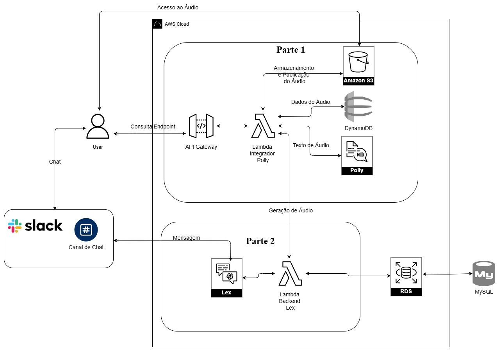

<h1 align="center">Desenvolvimento de Soluções AWS para Conversão de Texto em Áudio e Criação de um Chatbot</h1>

<h2 align="center"><i>Conheça a AUrora - Chatbot Para a Clínica Veterinária AUmigo</i></h2>

<div  align="center"></div>


## 📋 Índice

1. [Objetivo](#-objetivo)
2. [Descrição](#-descrição)
3. [Como Utilizar o Chatbot](#robot-como-utilizar-o-chatbot)
4. [Como Utilizar o Código](#-como-utilizar-o-código)
5. [Estrutura do Projeto](#-estrutura-do-projeto)
6. [Tecnologias Utilizadas](#-tecnologias-utilizadas)
7. [Arquitetura do Projeto](#️-arquitetura-do-projeto)
8. [Dificuldades](#️-dificuldades)
9. [Agradecimentos](#-agradecimentos)
10. [Autores](#-autores)

## 🎯 Objetivo
   <p> Desenvolver um endpoint para conversão de texto em áudio e criar um chatbot, que deve ter a opção de enviar a resposta em áudio, utilizando o texto de resposta do chatbot, com uso da API. </p>

## 📖 Descrição
   <p> O chatbot desenvolvido se chama Aurora e foi programado para a clínica veterinária AUmigo. </p>
    Este projeto consistiu em duas partes principais:

1. **Endpoint para Conversão de Texto em Áudio (/v1/tts)**


    - Recebe uma frase em formato JSON e converte o texto em áudio utilizando AWS Polly.
  
      
    - Armazena o áudio gerado em um bucket público do AWS S3.
  
      
    - Salva referências da frase e do áudio no DynamoDB, utilizando um hash code único.
  
      
    - Retorna a URL do áudio e outras informações relevantes se a frase já tiver sido processada anteriormente.
      

3. **Chatbot AUrora com Amazon Lex V2**

   
    - Desenvolvimento de um chatbot para a clínica veterinária AUmigo, que foi integrado ao Slack.
  
      
    - O chatbot possui sete intents distintas e captura informações através de slots.

        - Intents: `EncerrarConversa` `Menu` `DesmarcarConsulta` `Localizacao` `Saudacoes` `BuscarConsulta` `AgendarConsulta`
     
          
        - Slots: `RespostaConfirmacao` `OpcoesMenu` `Especies`

    - Utiliza response cards para interatividade e possui tratamento de fallback para erros.
    - Pode enviar respostas em áudio utilizando o endpoint /v1/tts.


## :robot: Como Utilizar o Chatbot

- Acesse o link de convite para o chatbot: :link: [Chatbot Aurora](https://join.slack.com/t/compassuolgrupo/shared_invite/zt-2mzx5k4fr-RCXRqR2PkQ5Kij_xtz3YSw);


- Você será direcionado para a página do Slack;


- Utilize seu endereço de e-mail para acessar o workspace;


- Inicie a conversa com a Aurora com "oi" ou palavras/frases semelhantes;

  
- Selecione o serviço desejado: `Agendar Consulta` | `Buscar Consulta` | `Cancelar Consulta` | `Localização e Horário`<br>


    -  <p align="justify"> Ao selecionar <code> Agendar Consulta</code>, você pode agendar uma consulta. Nesta intent será solicitada Seu Nome; E-mail; Telefone; Nome do Pet; Espécie do Pet; Data da Consulta; Horário da Consulta. </p>
        - Obs. Para a espécie de animais, serão aceitas variações de: Gato, cachorro, ramster e coelho. 

    
    -  <p align="justify"> Ao selecionar <code>Buscar Consulta</code>, você pode buscar uma consulta existente. Nesta intent será solicitada o seu E-mail;</p>
        - Obs. Nesta opção será possível obter o id do pet e o id da consulta.

    
    - <p align="justify"> Ao selecionar <code>Cancelar Consulta</code>, você pode cancelar uma consulta existente. Nesta intent será solicitada E-mail; id do pet e id da consulta.

    
    - Ao selecionar `Localização e Horário`, você pode ter acesso à localização da Clínica e seu horário de funcionamento.

    
- A qualquer momento o usuário pode cancelar a seção ao escrever "sair" ou frases/palavras semelhantes.


- A qualquer momento o usuário pode ver novamente os serviços disponíveis do menu ao escrever "menu" ou palavras/frases semelhantes.


## 🚀 Como Utilizar o Código

1. Pré-requisitos:

    - Python instalado
    - Conta AWS
    - Conta Slack
 
2. Clone o repositório:

    ```bash
    git clone -b grupo-6 https://github.com/Compass-pb-aws-2024-ABRIL/sprints-6-7-pb-aws-abril.git
    cd sprints-6-7-pb-aws-abril
    ```
3. Para rodar:
    - Configure a AWS CLI com suas credenciais
    - Adicione um arquivo .env conforme o .env.example

4. Ações na AWS
    - Crie uma tabela no DynamoDB com a chave primária `unique_id`
    - Crie um bucket no S3 e configure as permissões para ser público
    - Crie uma função lambda e adicione o código
    - Import o bot no Amazon Lex

5. Ações na Plataforma Slack
    - Crie um aplicativo de mensagem do Slack
    - Integre o aplicativo do Slack ao bot do Amazon Lex
    - Teste a integração iniciando uma conversa com seu bot do Amazon Lex. Você envia mensagens com o aplicativo do Slack e testa em uma janela do navegador.

## 📂 Estrutura do Projeto
```
project-root/
├── 📁 assets
│       └── sprint6-7.jpg                      # Arquitetura do projeto
│
├── 📁 src
│   ├── 📁 api-tts
│   │       ├── dynamodb_operations.py         # Criar, ler, atualizar e excluir itens na tabela do DynamoDB
│   │       ├── handler.py                     # Ponto de entrada para a função Lambda
│   │       ├── polly_operations.py            # Funções para interagir com o Amazon Polly, que converte texto em fala
│   │       ├── s3_operations.py               # Funções para interagir com o Amazon S3
│   │       ├── serverless.yml                 # Arquivo de configuração para o framework Serverless
│   │       └── utils.py                       # Funções utilitárias e auxiliares que são usadas em vários pontos do código, como formatação de dados ou validações comuns
│   │
│   └── 📁 chatbot
│       ├── 📁 bot lex
│       │       └── Aurora-DRAFT.zip          # Chatbot Aurora
│       ├── 📁 scripts
│       │   ├── 📁 lambda-function
│       │   │       └── lambda_function.py    # Código da função Lambda
│       │   └── setup_aurora_bd.py            # Script Python para configurar o banco de dados Aurora, incluindo a criação de tabelas
│       └── .env.example                      # Exemplo de arquivo de configuração .env, fornecendo um template para definir variáveis de ambiente necessárias para o projeto
└── README.md                                 # Documentação do projeto


```


## 💻 Tecnologias Utilizadas 

<p align="center">
    <code>AWS Polly</code> <code>AWS S3</code> <code>AWS DynamoDB</code> <code>Amazon Lex V2</code> <code>Slack</code> <code>MySQL</code> <code>Python (Boto3)</code> <code>Kanban</code> <code>Discord</code>
</p>


## 🏗️ Arquitetura do Projeto

<p align="center">
  
</p>


## 🛠️ Dificuldades

1. <p align="justify"> Tivemos dificuldades significativas ao tentar utilizar o chatbot com a conexão web. Após várias tentativas e ajustes sem sucesso, decidimos migrar a integração para o Slack.
</p>

2. <p align="justify"> A integração da API de voz no Lambda apresentou diversos desafios técnicos. Tivemos que garantir que todas as dependências fossem corretamente configuradas e que o ambiente estivesse preparado para lidar com solicitações de voz, o que exigiu uma série de testes e ajustes.
</p>


## 🙏 Agradecimentos

<p align="justify">É com imensa satisfação que o grupo-6 agradece à CompassUOL por providenciar o acesso aos cursos da Udemy, que geraram o aprendizado e desenvolvimento necessário para esta implementação e muito mais.</p>

## 👥 Autores

**Gabriel Venancio de Avelar**
- GitHub: https://github.com/GabrielAvelarbr

**Layon José Pedrosa Dos Reis**
- GitHub: https://github.com/Layonj300

**Luiz Fillipe Oliveira Morais**
- GitHub: https://github.com/LuizFillipe1

**Pâmela Aliny Cleto Pavan**
- GitHub: https://github.com/PamelaPavan
